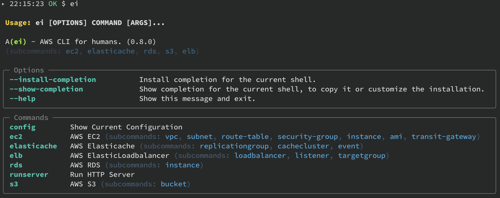

# A`[ei]`WS CLI

AWS CLI for humans. [](https://badge.fury.io/py/ei-cli)

[](https://codecov.io/gh/Ashon/ei)
[](https://github.com/Ashon/ei/actions/workflows/ci-py37.yml)
[](https://github.com/Ashon/ei/actions/workflows/ci-py38.yml)
[](https://github.com/Ashon/ei/actions/workflows/ci-py39.yml)
[](https://github.com/Ashon/ei/actions/workflows/ci-py310.yml)
[](https://github.com/Ashon/ei/actions/workflows/ci-py311.yml)

## Installation

Install via [pypi](https://pypi.org/project/ei-cli/)

``` sh
pip install ei-cli
```

Install via github

``` sh
pip install git+https://github.com/ashon/ei
```

## Configuration

``` sh
# set environment variables

# comma seperated account ids
EI_ACCOUNT_IDS='000000000000,111111111111'

# comma seperated region list
EI_REGIONS='ap-northeast-1,ap-northeast-2,ca-central-1,eu-west-2'

# sts assume role pattern for cross account
EI_ASSUME_ROLE_ARN_PATTERN='arn:aws:iam::{account_id}:role/my-awesome-role'
EI_ASSUME_ROLE_SESSION_NAME='AssumeRoleEi'

# use aws-vault for resolve aws environment vars
AWS_REGION=None
AWS_ACCESS_KEY_ID=None
AWS_SECRET_ACCESS_KEY=None
AWS_SECURITY_TOKEN=None
AWS_SESSION_EXPIRATION=None
```

## Run



Using aws-vault for cross account, region resource retrieving.

```
# list vpcs across all regions, and all accounts ($EI_REGIONS, $EI_ACCOUNT_IDS)
$ aws-vault exec {aws-vault-profile} -- ei ec2 vpc list --all-regions --all-accounts

# same as ec2
$ aws-vault exec {aws-vault-profile} -- ei ec2 instance list --all-regions --all-accounts

...
```

## Development

This project controlled by [Hatch](https://github.com/pypa/hatch).

``` sh
$ pip install hatch

# install package as editable mode
$ pip install -e .

# testing commands
$ hatch run lint
$ hatch run test
$ hatch run typecheck
```
